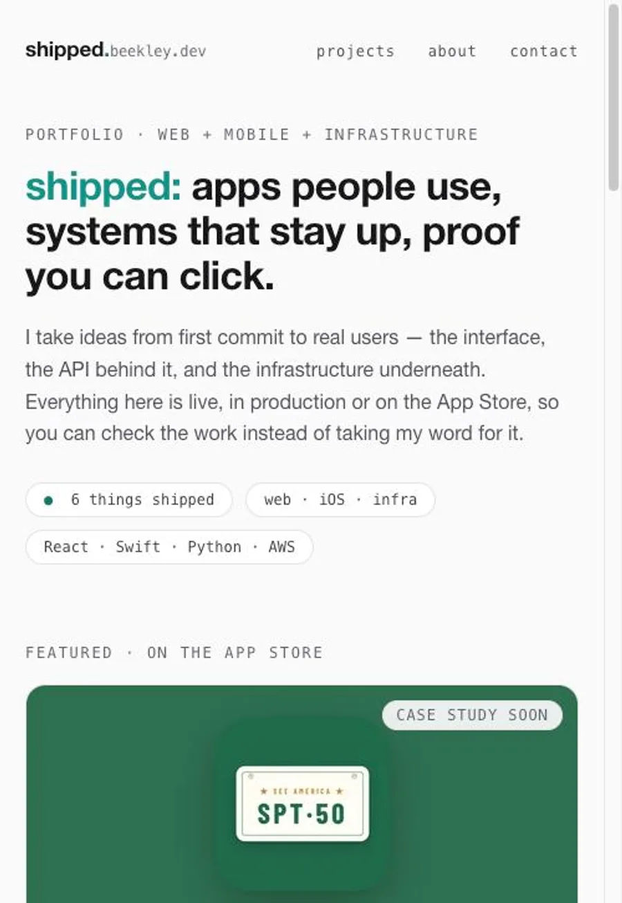

# Shipped

[](https://github.com/TCBeekley/Shipped/actions/workflows/ci.yml)
[](https://github.com/TCBeekley/Shipped/actions/workflows/codeql.yml)
[](LICENSE)

The source of [shipped.beekley.dev](https://shipped.beekley.dev) — a portfolio
whose argument is that every project on it is real: live, downloadable, or
running in production. Every page is static HTML: the home page is authored as
React components and rendered to markup at build time, and the case studies are
hand-written HTML. React is a build-time tool here, not a runtime dependency,
and there is no client-side router or hydration step.

The one script on the page is the Plausible tracker, proxied through this
domain rather than loaded from `plausible.io` — CloudFront forwards `/js/` and
`/api/event` upstream. That keeps the CSP at `script-src 'self'` with no
third-party host allowed, and leaves nothing on the page for a content blocker
to match, which matters when the audience is engineers.

Everything is served from S3 behind CloudFront, deployed by a build-once
pipeline that tags each build and promotes the exact artifact CI tested.

The repository is part of the work product: if the site claims the
infrastructure and delivery are sound, this is where you check.



## Prerequisites

- [Node.js](https://nodejs.org/) 24 (see `.nvmrc` — `nvm use` will pick it up)
- npm 11+ (bundled with Node 24)

## Setup

```bash
nvm use          # or otherwise ensure Node 24
make setup       # install dependencies + git hooks
```

## Development

```bash
make run         # start the Vite dev server (http://localhost:5173)
```

## Quality gates

```bash
make format      # auto-format with Prettier
make lint        # oxlint
make typecheck   # tsc project references (strict)
make test        # run the Vitest suite once
make test-cov    # run tests with coverage (fails below 80%)
make build       # production build into dist/
```

Git hooks (via Husky) run `lint-staged` on commit and validate the commit
message against Conventional Commits. See [CONTRIBUTING.md](CONTRIBUTING.md).

## Testing

Tests live under `tests/`, mirroring `src/`, and run on Vitest with
`@testing-library/react` (jsdom). Coverage must stay at or above **80%** —
thresholds are enforced in `vite.config.ts` and in CI.

## Deployment

Every push to `main` is a release candidate, versioned `MAJOR.MINOR.BUILD`
(semver with the patch position as a build number). Via
`.github/workflows/release.yml`:

1. Runs the full CI pipeline (lint, typecheck, test, build) — one artifact.
2. Tags the build `vMAJOR.MINOR.BUILD`: `MAJOR.MINOR` from `package.json`'s
   `version` (bump it deliberately for feature/breaking releases), build
   number from the workflow run number, so every build is uniquely versioned.
3. Deploys the exact `dist` artifact that pipeline built and tested — the
   deploy job downloads it and `aws s3 sync`s it to the target bucket; it
   never rebuilds (build once, deploy everywhere). Future environments become
   additional deploy jobs promoting the same artifact.
4. Creates a CloudFront invalidation so the new build is served immediately.

The tag marks the build; deployment is decided separately — the deploy job
uses the `production` GitHub Environment and requires manual approval. AWS
access uses OIDC (no long-lived keys) via an IAM role defined in
[`infra/`](infra/README.md).

Repo secrets:

| Secret                       | Purpose                               |
| ---------------------------- | ------------------------------------- |
| `AWS_ROLE_ARN`               | IAM role assumed via GitHub OIDC      |
| `AWS_REGION`                 | AWS region of the bucket/distribution |
| `S3_BUCKET`                  | Target S3 bucket name                 |
| `CLOUDFRONT_DISTRIBUTION_ID` | CloudFront distribution to invalidate |

To cut a release: merge to `main`, then approve the pending `production`
deployment in the Actions run.

## Infrastructure

AWS infrastructure is managed with CDK in [`infra/`](infra/README.md): a GitHub
OIDC deploy role and an S3 + CloudFront hosting stack serving
[shipped.beekley.dev](https://shipped.beekley.dev). Account-specific
identifiers resolve at synth time rather than being committed — see the
[infra README](infra/README.md#resolving-values).

## License

[MIT](LICENSE)
